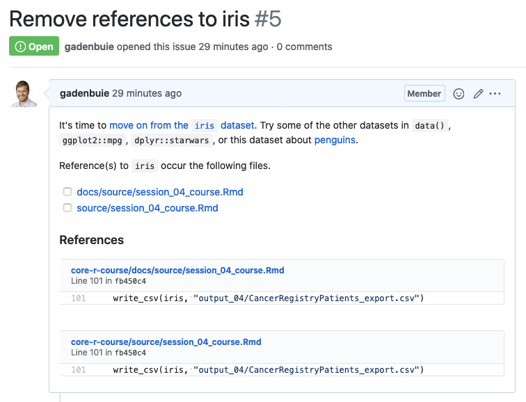

# Flag references to `iris` so you can remove them from your repos

Check out the source code at <https://git.io/de-iris-my-repos> first, and then run these lines. The CLI will walk you through the search results and will ask for confirmation before doing anything on your behalf.

```r
source("https://git.io/de-iris-my-repos")
iris_issues <- de_iris_my_repos()
```

`de_iris_my_repos()` is a simple CLI to search your repositories for references to the `iris` data set and open an issue in each repo where a reference appears to remind you to replace `iris` with another dataset.



> It's time to [move on from the `iris` dataset](https://armchairecology.blog/iris-dataset/). Try some of the other datasets in `data()`, `ggplot2::mpg`, `dplyr::starwars`, or this dataset about [penguins](https://github.com/allisonhorst/penguins).

The issue description includes a small bit of background and guidance, followed by a list of files where `iris` appears as well as direct links to the lines where `iris` is referenced.

### Options

A few options are available in `de_iris_my_repos()`

- `user`: The GitHub user name to review, by default the user associated with the GitHub PAT used by [gh](https://github.com/r-lib/gh)

- Set `dry_run = TRUE` to return results without doing anything

- Set `ask = FALSE` to go ahead and open issues in all repositories

- Use `extensions` to provide a list of file types where `iris` might be found.
